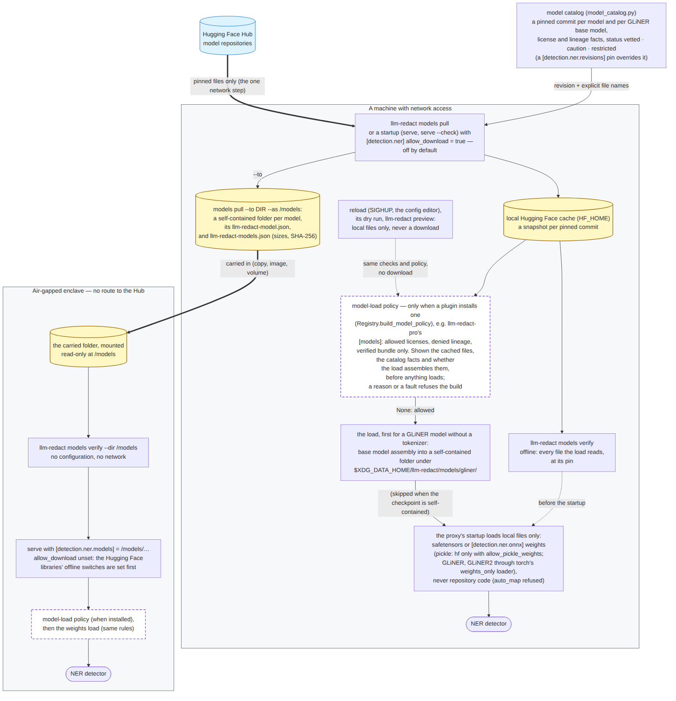

# Air-gapped installations

How to run llm-redact, NER models included, inside an enclave that has no
route to the internet. Everything the proxy needs is prepared on a connected
machine and carried in; inside, nothing is downloaded and nothing but your
LLM provider is ever contacted.

With `[detection.ner] allow_download` unset (it defaults to `false`) the
proxy opens no connection to load a model: the Hub backends (`hf`, `gliner`,
`gliner2`) read local folders only, the Hugging Face libraries' own offline
switches are set before they are imported, GLiNER folders carry their base
model's tokenizer and configuration, and Presidio's email check uses the
public suffix list its package ships. The CI `airgap` job proves this on
every change: it runs the steps below inside a network namespace with no
route and fails on any attempt to resolve a host or open a connection
([`.github/workflows/ci.yml`](../.github/workflows/ci.yml),
[`tests/airgap/`](../tests/airgap)).



*Static diagram. [Mermaid source](diagrams/model-supply-chain.mmd).*

## What the enclave needs

1. **The software**: the `-ner` container image
   (`ghcr.io/asanderson/llm-redact:<version>-ner`: the `hf` and `gliner`
   extras on a CPU-only torch), or, without containers, a wheelhouse
   ([deployment.md, "Offline installs"](deployment.md#offline-installs-no-container)).
2. **The models**: one folder per model, written by `llm-redact models pull
   --to DIR`, with the manifest `llm-redact-models.json` beside them (every
   file's size and SHA-256). Each folder is self-contained: a GLiNER model's
   folder includes its base model's tokenizer and configuration.
3. **A configuration** that loads the folders by their local paths — the
   `[detection.ner.models]` lines `models pull` prints — and leaves
   `allow_download` unset.

spaCy, Presidio and Stanza models are not Hugging Face snapshots: carry the
spaCy model's wheel (for example `en_core_web_sm-3.8.0-py3-none-any.whl`)
or Stanza's resource directory alongside (`llm-redact models list` prints
their install commands). The `-ner` image carries neither spaCy nor
Presidio; use a wheelhouse with `--extra presidio` for those backends.

## What still leaves the enclave

Only your requests to the LLM provider you configure, redacted as everywhere
else ([privacy.md](privacy.md)). The provider can itself be inside the
enclave: a private endpoint (`[providers.NAME] upstream_base_url`), or a
local model server such as Ollama or vLLM (`[providers.ollama]`,
`[providers.custom.NAME]`). The proxy sends no telemetry of its own (the
OpenTelemetry export and the audit sinks are opt-in and point where you
configure them), verifies a license offline, and never downloads a model
unless `allow_download = true` is set — and then only at startup.

## On the connected machine

```bash
# 1. The software: the -ner image (or build a wheelhouse instead).
docker pull ghcr.io/asanderson/llm-redact:<version>-ner
cosign verify ghcr.io/asanderson/llm-redact@<digest> \
  --certificate-identity-regexp 'https://github.com/asanderson/llm-redact/.*' \
  --certificate-oidc-issuer https://token.actions.githubusercontent.com
docker save ghcr.io/asanderson/llm-redact:<version>-ner | gzip > llm-redact-ner.tar.gz

# 2. The models the enclave's configuration will load, named by Hub id.
cat > pull.toml <<'EOF'
[detection.ner]
enabled = true
backends = ["hf", "gliner"]
EOF
mkdir -m 0755 models     # writable by you alone (see below)
docker run --rm --user "$(id -u):$(id -g)" -e HF_HOME=/tmp/hf \
  -v "$PWD/models:/out" -v "$PWD/pull.toml:/cfg/pull.toml:ro" \
  ghcr.io/asanderson/llm-redact:<version>-ner \
  models pull --to /out --as /models --config /cfg/pull.toml
#   -> prints the [detection.ner.models] lines for the folders mounted at /models
#   (an installed llm-redact runs the same: llm-redact models pull --to models --as /models ...)
llm-redact models verify --dir models    # or the same through docker run, as above
sha256sum models/llm-redact-models.json  # note it: compare it inside
tar czf models.tar.gz models
```

`models pull` fetches each model at the revision the model catalog pins (or
your `[detection.ner.revisions]` pin), with exactly the files the loader
reads. It needs network access to huggingface.co (and `HF_TOKEN` for a gated
model). The manifest makes `verify --dir` catch a damaged or partial copy;
it travels with the folders, so carry its SHA-256 by a separate channel if
someone on the way could alter both. For the same reason, nobody but you may
be able to write into `models/` before you have noted that SHA-256: whoever
can change a file there can rewrite the manifest to match, and the hash you
note would then vouch for the changed copy. The pull above therefore runs
the container as your own user (`--user`, with its Hugging Face cache in the
container's `/tmp`; rootless Podman: `--userns=keep-id`) into a folder only
you can write, never into a world-writable one.

## Inside the enclave

```bash
docker load < llm-redact-ner.tar.gz
tar xzf models.tar.gz
sha256sum models/llm-redact-models.json  # the value you noted outside

docker run --rm --network none -v "$PWD/models:/models:ro" \
  ghcr.io/asanderson/llm-redact:<version>-ner models verify --dir /models
```

Write the configuration with the lines `models pull` printed (and your
provider settings):

```toml
[detection.ner]
enabled = true
backends = ["hf", "gliner"]

[detection.ner.models]
hf = "/models/hf-dslim--bert-base-NER"
gliner = "/models/gliner-urchade--gliner_small-v2.1"
```

Check it with no network at all, then run the proxy:

```bash
docker run --rm --network none -v "$PWD/models:/models:ro" \
  -v "$PWD/config.toml:/etc/llm-redact/config.toml:ro" \
  ghcr.io/asanderson/llm-redact:<version>-ner serve --check --config /etc/llm-redact/config.toml

docker run -d --name llm-redact -p 127.0.0.1:8787:8787 --stop-timeout 90 \
  -v llm-redact-data:/data -v "$PWD/models:/models:ro" \
  -v "$PWD/config.toml:/etc/llm-redact/config.toml:ro" \
  ghcr.io/asanderson/llm-redact:<version>-ner serve --config /etc/llm-redact/config.toml
docker exec llm-redact llm-redact doctor
```

`serve --check` builds every detector, models included, exactly as the
startup does. An empty or unmounted `/models` stops it with `… is not a
directory: a model folder must be in place when the proxy starts …`
([troubleshooting](troubleshooting.md)); a folder that is incomplete names
what the loader misses. `doctor` reports under `models` that downloads are
off and that each model loads from its folder.

## Kubernetes (Helm)

Put the model folders on a volume (for example a PersistentVolumeClaim you
fill from `models.tar.gz`) and point the chart at it:

```yaml
image:
  variant: ner          # the -ner image tag
models:
  volume:
    persistentVolumeClaim: { claimName: llm-redact-models, readOnly: true }
extraConfig: |
  [detection.ner]
  enabled = true
  backends = ["hf", "gliner"]
  [detection.ner.models]
  hf = "/models/hf-dslim--bert-base-NER"
  gliner = "/models/gliner-urchade--gliner_small-v2.1"
```

The chart mounts the volume read-only at `/models` and sets
`HF_HUB_OFFLINE=1` and `TRANSFORMERS_OFFLINE=1`; the container's root
filesystem stays read-only. Mirror the image into the enclave's registry and
set `image.repository` to it. Check the volume from the pod:
`kubectl exec deploy/<release>-llm-redact -c llm-redact -- llm-redact models verify --dir /models`.

## systemd (native installs)

Install from the wheelhouse ([deployment.md, "Offline installs"](deployment.md#offline-installs-no-container)),
put the folders somewhere the service user can read, write the
configuration with their paths, then `llm-redact service install`. The
generated unit already runs with `ProtectHome=read-only` and writes only
the llm-redact data, config and state directories; models load from the
folders, so it needs no writable cache. To keep the service itself from
reaching anything but your provider, add a drop-in (`systemctl --user edit
llm-redact`):

```ini
[Service]
IPAddressDeny=any
IPAddressAllow=localhost
# your provider's address(es), for example a private endpoint or local model server:
IPAddressAllow=10.20.0.15/32
```

`localhost` must stay allowed: your tools reach the proxy over loopback.
These settings need eBPF control-group support in the kernel and have no
effect without it (systemd.resource-control(5)); treat them as defense in
depth beside the enclave's own firewall.

## Troubleshooting

- `… is not a directory: a model folder must be in place …` — the folder
  named in `[detection.ner.models]` is not there: mount or copy it, and
  check it with `models verify --dir`.
- `… is not (completely) in the local Hugging Face cache, and downloads are
  off …` — the configuration names a Hub id instead of a folder: use the
  lines `models pull --to` printed.
- `models verify --dir`: `SHA-256 differs from the manifest`, `missing`,
  `not listed in the manifest` — the copy is damaged or was changed: carry
  the folder again.
- `[detection.ner] backend = "…" but the … extra is not installed` — the
  stock image or an install without the NER extras: use the `-ner` image or
  a wheelhouse with the backend's extra.

Each message has its entry in [troubleshooting.md](troubleshooting.md).
