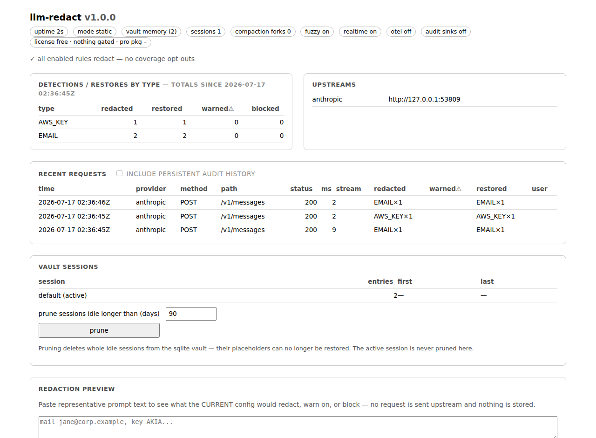
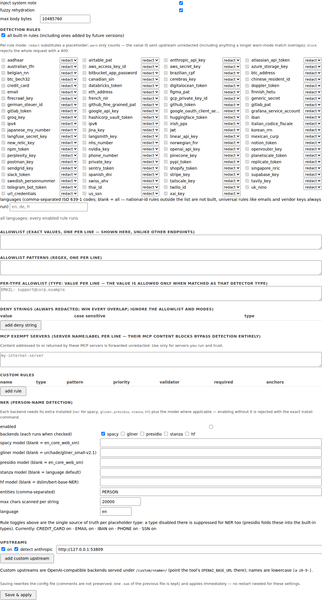
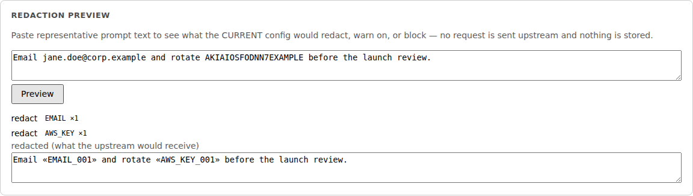

# The local ops surface: dashboard, editor, status, metrics

Reserved `/__llm-redact/*` paths are answered locally, never forwarded,
and carry metadata only — never redacted values. The namespace is
GET-only except the guarded config-editor, session-prune, and preview
POSTs, and every reply is hardened with a strict CSP and
framing/sniffing headers.

(Screenshots are captured against fixture traffic by
`scripts/capture_screenshots.py`; the PNGs live in
[screenshots/](screenshots/), separate from the architecture diagrams.
The agent plugin commands have their own terminal-output screenshots in
[plugins.md](plugins.md), captured by
`scripts/capture_plugin_screenshots.py`.)

- **Dashboard**: open <http://127.0.0.1:8787/__llm-redact/> in a browser — a
  single self-contained page (no CDNs, works offline) showing version,
  uptime, session mode, vault size, detection/restore totals by type,
  upstreams, and the recent-request table (with a pointer to enable the
  audit log if it's off). New requests appear instantly via the
  `GET /__llm-redact/events` server-sent-event feed (metadata-only rows,
  same shape as `/recent`); the 3 s poll keeps running as the
  authoritative fallback and pauses when the tab is hidden.
- **Config editor**: the dashboard's Configuration card edits the
  hot-reloadable settings (rules — grouped by placeholder type — with
  per-rule modes, allowlists incl. per-type, deny strings, custom rules,
  NER backend/entities/language/model, provider upstreams and
  enable/disable, fuzzy/system-note/size-limit) and applies them
  immediately, rewriting the config file (comments are not preserved; one
  `.bak` is kept). Restart-only settings (host/port/vault/audit/log/tls/
  otel) stay read-only. This is the
  reserved namespace's one mutating endpoint (`POST /__llm-redact/config`)
  and it is layered against cross-site abuse: Host-header validation (DNS
  rebinding), Origin validation, and a per-process CSRF token that only
  same-origin pages can read, carried in a custom header that forces a CORS
  preflight. Note: unlike every other local endpoint, its GET returns
  allowlist *values* (an editor can't edit counts) — still metadata-free of
  vault contents.
- **Status**: `llm-redact status` (or `GET /__llm-redact/status`) reports the
  same live totals as JSON.
- **Metrics**: `GET /__llm-redact/metrics` exposes Prometheus text format
  (always on, in-memory): `llm_redact_requests_total{provider,status}`, a
  request-duration histogram labeled by `provider` and `streamed` (so
  per-provider p95 and streaming-vs-non-streaming latency are separable),
  detections/restores by type, vault entry/session gauges, start time and
  uptime. Scrape config, alert rules, and the Grafana dashboard are in
  [observability.md](observability.md).
- **Health probes**: `GET /__llm-redact/healthz` is a DB-free liveness
  check (`{"status": "ok"}`) and `/readyz` reports readiness (version +
  whether the realtime extra is available). Orchestrators should probe
  these rather than `/status`, which reads the vault on every call; the
  container and compose healthchecks already do.
- **Audit log** (`[audit] enabled = true`), its tamper-evident chain, and the
  off-machine **object-store sinks** (S3-compatible / Azure Blob, with
  client-side batch encryption) are **Pro** features of the
  `llm-redact-pro` package (**coming soon**) — a local metadata-only
  history (types, counts, paths, durations — never values).
- **Redaction preview / dry-run**: paste text into the dashboard's
  "Redaction preview" card, `POST /__llm-redact/preview`, or run
  `llm-redact preview --text "…"` (or pipe to stdin) to see what the
  current config *would* redact, warn on, or block — no request is sent
  upstream and nothing is written to the vault, metrics, or audit log.
  Iterate on rules, allowlists, modes, and language scope offline.
- **Coverage posture, surfaced loudly**: `llm-redact status` and
  `llm-redact doctor` both report every configured opt-out that lets
  traffic through unredacted — warn-mode types, providers with detection
  off, MCP exempt servers, language-scoped-out national-id rules — and
  say so plainly when nothing is opted out. Protection is never quietly
  reduced.
- **Agent plugins**: the dashboard and config-editor workflows are also
  available as slash commands inside Claude Code, Codex, OpenCode, and
  Cursor —
  `/llm-redact:status`, `/llm-redact:recent`, `/llm-redact:preview`, a
  guarded `/llm-redact:config-edit` (effective-config read → TOML edit →
  `serve --check` gate → SIGHUP → posture read-back), and more. Claude
  Code installs the repo as a plugin marketplace
  (`/plugin marketplace add asanderson/llm-redact`); every tool can also
  use `llm-redact plugin install claude|codex|opencode|cursor`. Command
  bodies open with a proxy-presence guard: a missing `llm-redact` CLI
  stops the command and asks your approval before anything is installed. `lookup` is
  deliberately not a command — an agent that read a secret value would
  send it upstream. See [plugins.md](plugins.md).

The **user guide** — the same surface written for the person *using*
the proxy rather than deploying it — ships in the package and is served
by every running proxy at `/__llm-redact/guide` (also `llm-redact
guide`, or `/llm-redact-guide` from an agent with the plugin installed).
