# Agent plugins: the dashboard and config editor as slash commands

llm-redact ships slash-command plugins for **Claude Code**, **Codex**,
**OpenCode**, and **Cursor** that put the web dashboard's and config editor's workflows
inside the agent session itself: check the proxy's posture, watch recent
traffic, preview redaction, verify the audit chain, and make guarded
config edits — without leaving the tool the proxy is protecting.

All four plugins carry the SAME nine commands, defined once in
`src/llm_redact/plugin_assets.py` and rendered into each tool's command
format.

## Install

### Claude Code

Two options:

```text
# As a proper plugin (namespaced /llm-redact:status etc.), from a checkout
# or the git host:
/plugin marketplace add asanderson/llm-redact
/plugin install llm-redact@llm-redact
```

```bash
# Or from a pip/uv install, as personal commands (/llm-redact-status etc.):
llm-redact plugin install claude
```

Every `plugin install` ends with a proxy step: pass
`--proxy-url https://host:8787` to point the commands at an EXISTING
llm-redact proxy (probed via `/__llm-redact/status`; plain http is
loopback-only — a remote proxy must be https), or `--install-proxy` to
set a local one up (`init --yes` when no config exists, then
`service install`). On a terminal with neither flag and no proxy
answering, a single prompt offers install / point / skip; scripts get the
old skip-with-hint behavior. A pointed-at proxy persists via the
`LLM_REDACT_PROXY_URL` env var, which `llm-redact run` and
`llm-redact status` honor everywhere.

### Codex

```bash
llm-redact plugin install codex     # writes ~/.codex/prompts/llm-redact-*.md
```

Invoke as `/prompts:llm-redact-status` (Codex custom prompts are its
slash-command mechanism; Codex marks them deprecated in favor of skills,
but they remain the explicit-invocation surface these commands want).
`CODEX_HOME` is honored.

### OpenCode

```bash
llm-redact plugin install opencode  # writes ~/.config/opencode/commands/llm-redact-*.md
```

Invoke as `/llm-redact-status`. `XDG_CONFIG_HOME` is honored.

### Cursor

```bash
llm-redact plugin install cursor    # writes ~/.cursor/commands/llm-redact-*.md
```

Invoke as `/llm-redact-status` from the chat input. Cursor commands are
plain markdown (the whole file is the prompt — no frontmatter, no
argument substitution), so the rendered files differ slightly: the
description becomes a heading, and where other tools substitute
`$ARGUMENTS` the Cursor text asks the agent to use the request you typed
alongside the command.

`llm-redact plugin status` shows per-tool install state (current / stale /
missing); `llm-redact plugin uninstall TOOL` removes exactly the files the
installer manages. `install` never silently overwrites a command file you
have edited — it refuses and asks for `--force`.

## The commands

| Command | What it does | Web-UI equivalent |
|---|---|---|
| `status` | Proxy counters, detections by type, and the FULL protection-posture block | dashboard header + posture pills |
| `recent` | Newest-first table of recent requests (path, provider, status, detections) | dashboard recent-request table |
| `sessions` | Vault session list (metadata only); prune only on explicit confirmation | dashboard session browser |
| `config-show` | Effective config with env overrides named | config editor (read side) |
| `config-edit` | Guarded config change: effective-config read → TOML edit → `serve --check` gate → SIGHUP → posture read-back | config editor (write side) |
| `preview` | Local dry-run: what WOULD be redacted in a sample text | dashboard preview card |
| `doctor` | Read-only diagnostics, failures explained via troubleshooting.md | — |
| `audit` | Tamper-evident chain verification verdict | dashboard audit block |
| `users` | Seat usage and invite/revoke guidance (never prints per-user keys) | dashboard users card |
| `guide` | Displays the user guide | `/__llm-redact/guide` |

`config-edit` is marked user-invocation-only in Claude Code
(`disable-model-invocation: true`): an agent may not decide on its own to
rewrite your protection config.

## What the commands look like

The plugin commands are terminal UIs — each one runs an `llm-redact` CLI
command and the agent presents its output. The screenshots below are the
REAL output of those commands against a proxy fed only fixture traffic
(secret-shaped fakes: vendors' canonical example keys, `corp.example`
addresses); the one multi-step command, `config-edit`, is shown as a
Claude Code session whose step outputs are likewise real and executed in
order. Regenerate with `uv run python
scripts/capture_plugin_screenshots.py`.

Every command, in the order the plugin lists them:

**`/llm-redact:status`** — live totals and posture:

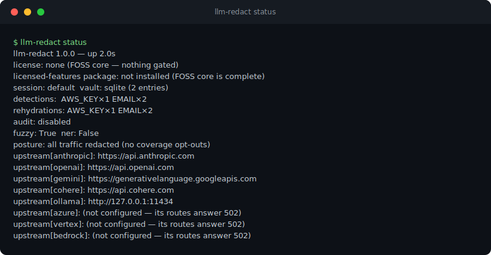

**`/llm-redact:recent`** — the metadata-only recent-request ring buffer
(the one command that fetches an endpoint instead of running the CLI):

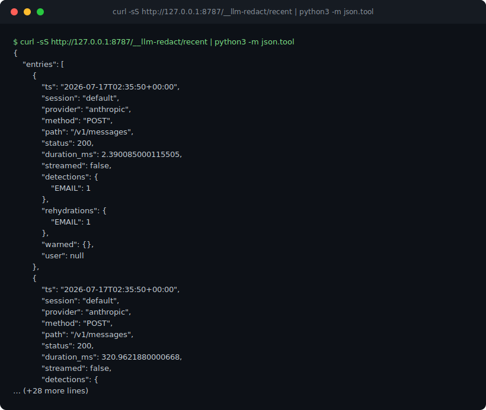

**`/llm-redact:sessions`** — the vault's session list:

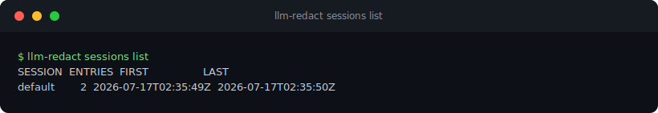

**`/llm-redact:config-show`** — the effective configuration:

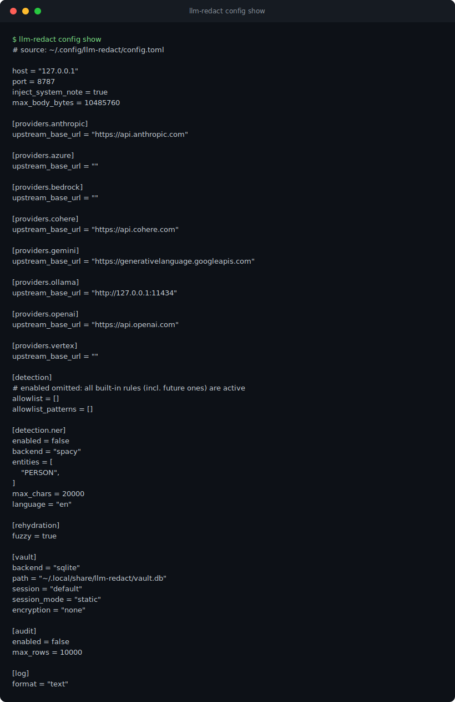

**`/llm-redact:config-edit`** — the web config editor's workflow, driven
from inside the agent: read the effective config, edit the TOML, gate on
`serve --check`, reload via SIGHUP, and read the coverage posture back.
A session as Claude Code presents it (the agent narration is
illustrative; every command output is the fixture rig's real output,
executed in this order — note the posture read-back catching the
warn-mode opt-out):

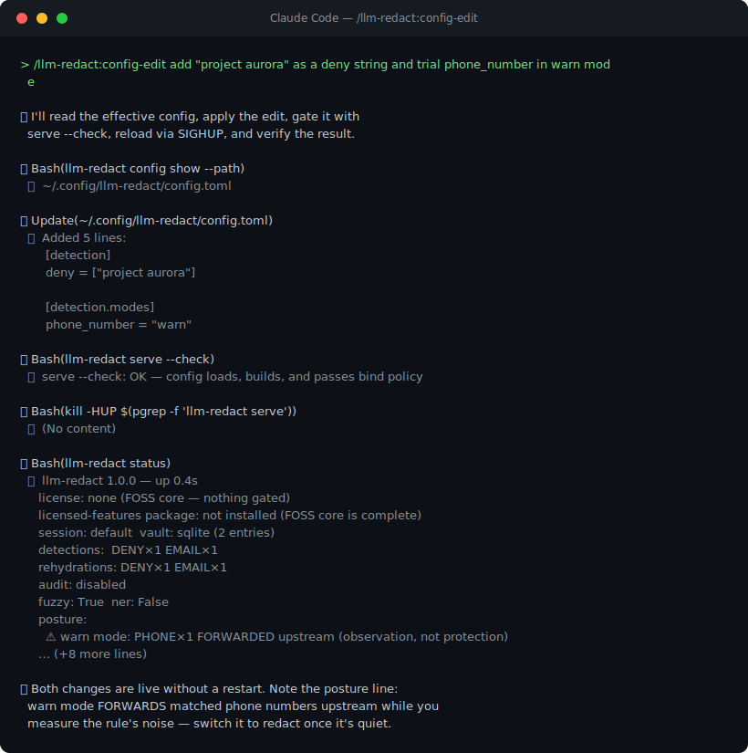

The same workflow reaches every hot-editable setting; three more
sessions, each verified a different way:

*A per-type allowlist — stop redacting one public address without
loosening anything else, proven by the local preview dry-run:*

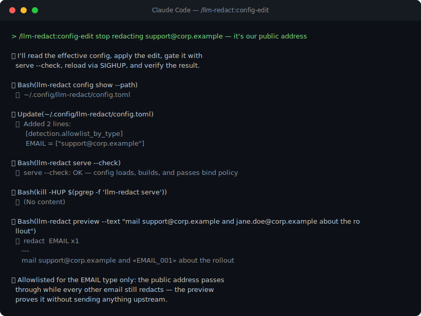

*Block mode — private keys rejected before any upstream contact; the
preview read-back shows the fail-closed 400:*

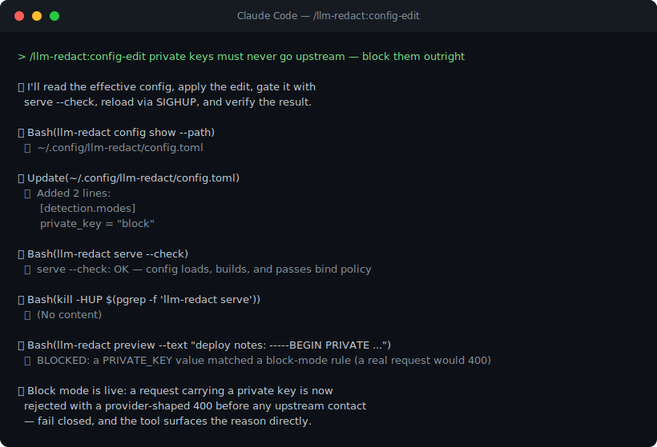

*Language scoping — and the loud posture read-back every opt-out gets:*

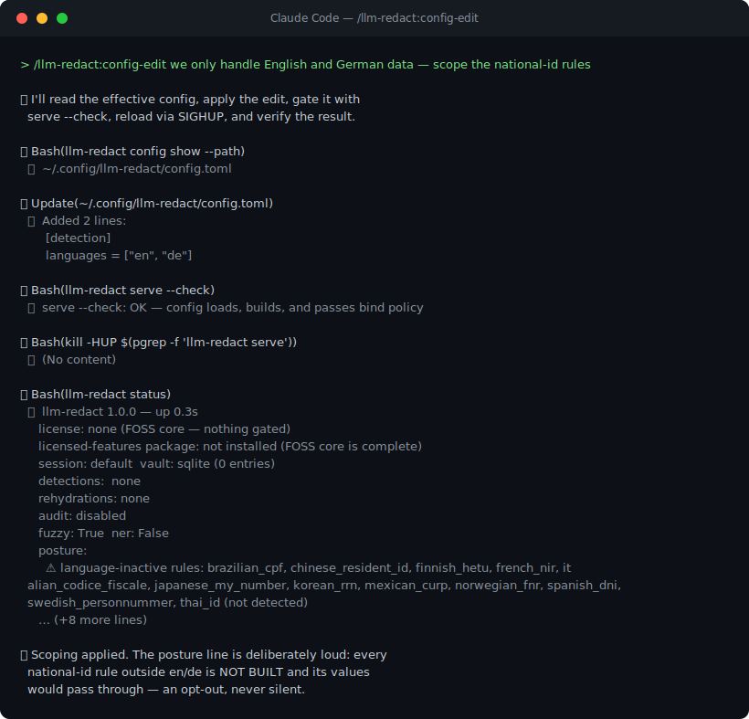

**`/llm-redact:preview`** — the local redaction dry-run:

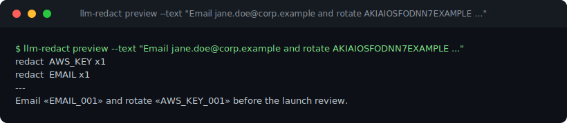

**`/llm-redact:doctor`** — the read-only diagnostics:

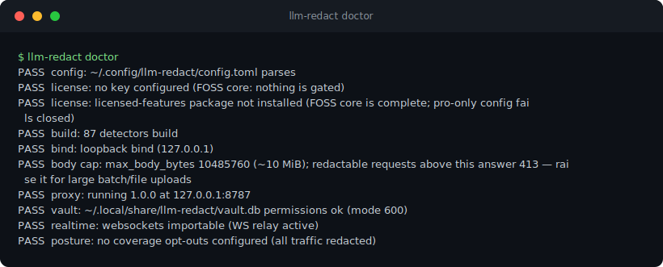

**`/llm-redact:audit`** — the audit log lives in the paid
`llm-redact-pro` package (**coming soon**), so this is the honest
package-absent output; with `llm-redact-pro` installed and `[audit]`
enabled it reports rows checked and the chain verdict:

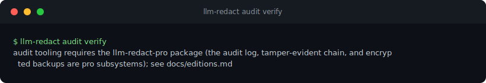

**`/llm-redact:users`** — likewise an `llm-redact-pro` subsystem
(**coming soon**); with it installed this lists named seats (active vs
pending vs the tier cap):

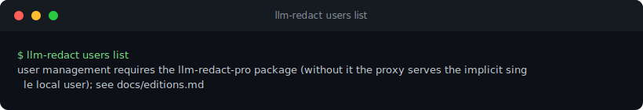

**`/llm-redact:guide`** — the packaged user guide (shot truncated; the
command prints the whole document):

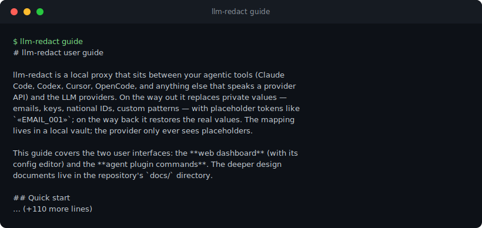

And the installer itself:

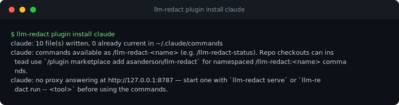

## What is deliberately NOT a command

`llm-redact lookup` resolves placeholders back to their secret VALUES. An
agent that runs it carries the value into its conversation — and the next
request sends that conversation to the provider, which is the exact leak
the proxy exists to prevent. The exclusion is pinned by test
(`tests/test_plugins.py::test_lookup_is_never_a_plugin_command`); run
`lookup` yourself in a terminal when you need it.

## The proxy-presence guard

Every command body starts with a guard: if the `llm-redact` CLI is not
on PATH (a marketplace install can land on a machine that never had the
proxy), the agent must STOP, say so, and ask your approval before
installing it (`uv tool install llm-redact-proxy` / `pipx install
llm-redact-proxy`) — it never installs on its own initiative. The guard
is rendered into all four tools' files and pinned by test. On the CLI
side, `llm-redact plugin install` ends with a proxy posture line —
whether a proxy is answering right now, and how to start one if not.

The command bodies never widen what leaves the machine: status, recent,
sessions, and audit are metadata-only surfaces by design, and preview
returns your own text already masked.

## For contributors

Edit `src/llm_redact/plugin_assets.py`, then re-render the checked-in
Claude Code plugin and marketplace manifest:

```bash
uv run python scripts/render_plugins.py
```

`tests/test_plugins.py` pins the rendered files to the module in both
directions (stale content or stray files fail CI), keeps every
`llm-redact` invocation inside command bodies pointing at a real CLI
subcommand, and enforces the lookup exclusion.
