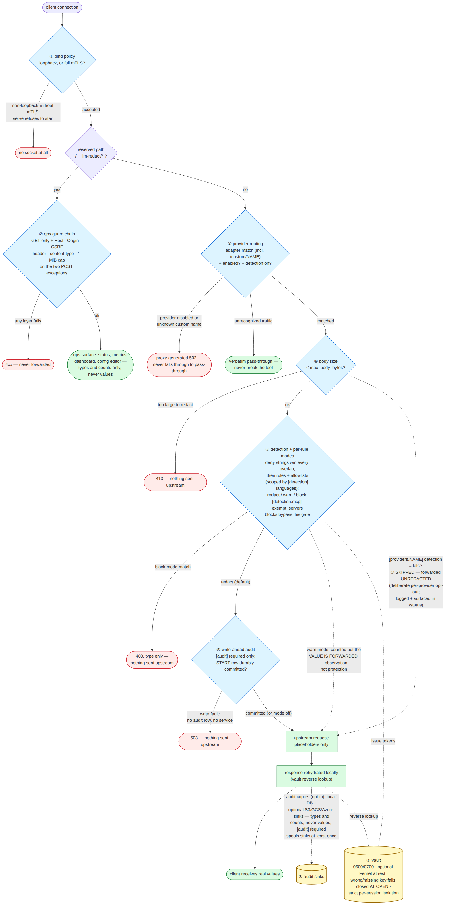

# Security-relevant data flows

Where security decisions are *made* and where they are *enforced*, in
NIST SP 800-162 terms: each control below is split into its **PDP**
(policy decision point — what evaluates the policy, and against which
inputs) and its **PEP** (policy enforcement point — the code that acts on
the decision). The **PAP** (policy administration point) is the TOML
config file, editable by hand, by `llm-redact init`, or through the
dashboard config editor — which is itself defended as gate ② below and
revalidates every edit through the production parser plus a dry-run
detector build before anything is written or applied.

This page maps the flows; [threat-model.md](threat-model.md) explains why
the boundaries sit where they do, and [SECURITY.md](SECURITY.md)
defines what counts as a vulnerability against them.

*Mermaid source: [diagrams/security-gates.mmd](diagrams/security-gates.mmd).*

## The gates

In llm-redact the PDP and PEP of each gate are deliberately colocated in
one process — there is no network hop between deciding and enforcing, so
there is no decision channel to attack. The split below is therefore
about *code roles*, and it is where to look when auditing.

| # | Policy question | PDP — decided by | PEP — enforced by | On refusal |
|---|---|---|---|---|
| ① | May this socket exist at all? | `validate_bind_security` (`config.py`): non-loopback hosts require the full mTLS trio (`certfile` + `keyfile` + `client_ca`); unresolvable hostnames count as non-loopback; `LLM_REDACT_INSECURE_BIND=1` is the container-netns hatch | `serve` (`cli.py`) refuses to start **before binding**; with mTLS, uvicorn runs `ssl_cert_reqs=CERT_REQUIRED`, so unauthenticated clients fail the TLS handshake | no socket / handshake failure |
| ② | May this request use the local ops surface? | The guard chain in `proxy.py`: GET-only except three POSTs (`/config`, `/sessions/prune`, `/preview`), each layered Host validation (DNS rebinding) → Origin → per-process CSRF token in a custom header (forces a CORS preflight that 405s with no CORS headers) → JSON content-type → 1 MiB cap; every reserved reply also carries browser-hardening headers (`_SECURITY_HEADERS`: strict CSP + `X-Frame-Options`/`nosniff`/`Referrer-Policy`) | Reserved `/__llm-redact/*` paths are answered by the **first statement** of `handle()` — provably never forwarded upstream; failing any layer answers 4xx; the response headers block framing, remote-code injection, and Referer leakage as defense-in-depth | 4xx, never forwarded |
| ③ | Is this traffic for a known, enabled provider — and does it get detection? | Adapter `matches()` (`providers/`) plus `[providers.NAME] enabled` and `detection` from config; named `[providers.custom.NAME]` upstreams route under `/custom/NAME/` and an unknown custom name has nowhere sane to go | `handle()` answers a proxy-generated **502 before the body is read** for disabled or unknown-custom providers — never falls through to pass-through; the WebSocket relay (`realtime.py`) refuses with accept-then-close **1011**. `detection = false` skips gate ⑤ entirely — a **deliberate per-provider opt-out** (requests reach that upstream unredacted; rehydration stays active) surfaced per request in the log, in `/status` `providers_detection_off`, and on the dashboard | 502 (HTTP) / close 1011 (WS) |
| ④ | Can the body be buffered and redacted? | `max_body_bytes` from config (default 10 MiB) | `handle()` rejects oversized redactable bodies **413 fail-closed** — nothing is sent upstream unredacted | 413, nothing upstream |
| ⑤ | What in this body is private, and what happens to it? | The detection engine (`detection/`): deny strings (tier 0, win every overlap, bypass all allowlists), regex rules + checksum validators (+ optional NER), overlap resolution in `redactor.py`, per-rule modes via `build_modes` — the *winning* detection's mode governs. National-id rules outside `[detection] languages` are not built at all (`active_rule_names`, surfaced in `/status` and the editor) | `redact_text` substitutes vault tokens (redact); `BlockedRequest` becomes a provider-shaped **400 before any upstream contact**, carrying the detector type and never the value (block); **warn mode enforces nothing** — the value is counted and forwarded upstream; it is observation, not protection. MCP connector config blocks (`mcp_servers`, `tools type=mcp`) are stripped before this gate BY DESIGN — they are provider-directed credentials the provider must receive (docs/api-coverage.md) — and content blocks addressed to `[detection.mcp] exempt_servers` are stashed around it (a per-server opt-out; uncorrelatable Anthropic result blocks stay redacted, fail-closed) | 400 (block only) |
| ⑥ | May this request proceed without a durable audit record? (`[audit] required` only) | `AuditConfig.required` (parse-gated: needs `enabled`; startup-gated: the built `AuditLog` must have the write-ahead `begin`/`finalize` pair, else `ConfigError`) | `ProxyState.begin_audit` (`proxy.py`) durably commits a write-ahead START row AFTER redaction and BEFORE any byte leaves for the provider — HTTP and the realtime WS relay alike; on `AuditWriteError` the request is refused with a provider-shaped **503** (WS: accept-then-close) and nothing reaches the upstream. Off by default: without `required`, this gate does not exist and the audit trail stays fail-open | 503, nothing upstream |
| ⑦ | Who can read the placeholder↔value mapping? | Key resolution `vault_crypto.from_env`: env var → OS keychain → **fail closed**; keyring backend errors count as key-absent, never a silent downgrade. Session isolation is decided *by construction*: token names collide across sessions, so no fallback lookup can exist | SQLite vaults are created `0600` in `0700` dirs; a wrong or missing key aborts **at open** (`vault.py`) rather than serving garbage; per-session views never read across sessions; pruning deletes whole sessions only | startup/open failure |

Two request-path outcomes are **fail-open by design**, and both are
deliberate scope decisions rather than gaps:

- **Unrecognized traffic passes through verbatim** (gate ③). Breaking the
  tool teaches users to remove the proxy, which protects nothing. The
  same principle degrades a corrupt Bedrock eventstream frame to verbatim
  pass-through: unrestored placeholders are safe; guessing at corrupt
  frames is not.
- **An unrestorable placeholder stays a placeholder** (rehydration).
  Fuzzy repair only restores a candidate that the vault confirms; a miss
  passes through verbatim — never a wrong value.

## What leaves the machine, per channel

| Channel | Carries | Never carries |
|---|---|---|
| Upstream request (gate ⑤ output) | placeholders, plus warn-mode values (documented above), plus everything sent to a provider with `detection = false` or inside an exempt MCP server's blocks — both deliberate opt-outs | redacted originals |
| Logs (text or JSON) | path, status, detection counts | values, headers, bodies, URLs with query strings (`?key=` auth) |
| `/__llm-redact/*` + dashboard, `/recent`, `/events` | detector types + counts, session metadata | values, placeholder ids, allowlist contents (config-editor GET is the documented exception, behind gate ②) |
| Audit DB (opt-in, local) | same metadata + durations | values, placeholder ids |
| S3 audit sink (opt-in, `[audit.s3]`) | the same audit rows as NDJSON batch objects — shipping them to a bucket is an explicit off-machine trust decision; credentials come from the AWS env vars, never the config file; failures WARN and drop (under `[audit] required`: spool from the audit DB, retry until confirmed — never drop) | values, placeholder ids, credentials |
| OpenTelemetry (opt-in) | same metadata as spans/counters — pointing `endpoint` at a remote collector is an explicit trust decision | values, headers, placeholder ids |
| Vault | — (never leaves the machine) | — |

## Realtime WebSocket connections

The same gates apply at the relay (`realtime.py`), shifted to WS
mechanics: unknown paths, disabled providers, and a missing `realtime`
extra are refused accept-then-close **1011** (without the extra the
server cannot accept upgrades at all, so realtime traffic can never
silently bypass redaction); a block-mode match closes **1008** carrying
the detector type only; headers, `?key=` queries, and subprotocols pass
through unlogged; and gate ⑤ walks **every** client event, skipping only
structural keys and base64 audio — voice audio is never decoded or
scanned, so speech reaches the provider unredacted (see the threat
model's media non-goal).
