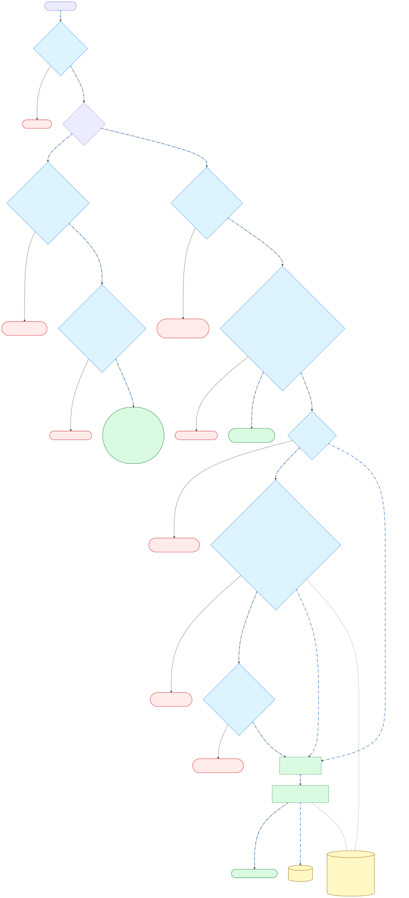

# Security-relevant data flows

Where security decisions are *made* and where they are *enforced*, in
NIST SP 800-162 terms: each control below is split into its **PDP**
(policy decision point — what evaluates the policy, and against which
inputs) and its **PEP** (policy enforcement point — the code that acts on
the decision). The **PAP** (policy administration point) is the TOML
config file, editable by hand, by `llm-redact init`, by the guarded
`config-edit` agent command (`serve --check` gate, then SIGHUP), or —
with llm-redact-pro — through the dashboard config editor, which is
itself defended as gate ② below and revalidates every edit through the
production parser plus a dry-run detector build before anything is
written or applied.

This page maps the flows; [threat-model.md](threat-model.md) explains why
the boundaries sit where they do, and [SECURITY.md](SECURITY.md)
defines what counts as a vulnerability against them.

*Animated: the flow along the accepted path moves; refusals are static. Static [PNG](diagrams/security-gates.png) · [GIF](diagrams/security-gates.gif) · Mermaid source: [diagrams/security-gates.mmd](diagrams/security-gates.mmd).*

## The gates

In llm-redact the PDP and PEP of each gate are deliberately colocated in
one process — there is no network hop between deciding and enforcing, so
there is no decision channel to attack. The split below is therefore
about *code roles*, and it is where to look when auditing.

| # | Policy question | PDP — decided by | PEP — enforced by | On refusal |
|---|---|---|---|---|
| ① | May this socket exist at all? | `validate_bind_security` (`config.py`): non-loopback hosts require the full mTLS trio (`certfile` + `keyfile` + `client_ca`); unresolvable hostnames count as non-loopback; `LLM_REDACT_INSECURE_BIND=1` is the container-netns hatch | `serve` (`cli.py`) refuses to start **before binding**; with mTLS, uvicorn runs `ssl_cert_reqs=CERT_REQUIRED`, so unauthenticated clients fail the TLS handshake | no socket / handshake failure |
| ② | May this request use the local ops surface? | The guard chain in `proxy.py`: GET-only except the guarded POSTs (`/sessions/prune`; with llm-redact-pro also the dashboard's `/config` and `/preview` and the access gate's `/users/invite` and `/users/revoke`), each layered Host validation (DNS rebinding) → Origin → per-process CSRF token in a custom header (forces a CORS preflight that 405s with no CORS headers) → JSON content-type → 1 MiB cap; every reserved reply also carries browser-hardening headers (`_SECURITY_HEADERS`: strict CSP + `X-Frame-Options`/`nosniff`/`Referrer-Policy`); with llm-redact-pro's access gate guarding the dashboard, every reserved path except the monitoring probes and the gate's sign-in/SCIM paths first passes the gate's dashboard admission (403, or a 303 to a same-proxy sign-in page for a browser GET), and only then may the Host/Origin checks accept the gate's one public origin | Reserved `/__llm-redact/*` paths are answered by the **first statement** of `handle()` — provably never forwarded upstream; failing any layer answers 4xx; the response headers block framing, remote-code injection, and Referer leakage as defense-in-depth | 4xx, never forwarded |
| ②½ | Who is this client, and may it use the proxy? | **llm-redact-pro's access gate** (`plugin_api.AccessGate`): named users, per-user keys and seats — this repository holds no authentication code. The gate runs first (it may await a directory or identity provider) and removes every credential it recognizes from the request. Under mutual TLS, `serve` hands it the verified client certificate as the standard ASGI TLS extension (`tls_scope.py`); the core itself reads nothing from it. Without the package, every client is the implicit single local user, and two leak guards in `proxy.py` still hold: every `x-llm-redact-*` request header is dropped before forwarding (HTTP and WebSocket), and a `/u/…` identity path is answered locally, never forwarded or recorded | `handle()` applies the gate's refusal as a provider-shaped **403** after the disabled-provider 502 and before the body is read; the WebSocket relay closes **1011** with the gate's message — recorded as a 403 either way | 403 (HTTP) / close 1011 (WS) |
| ②¾ | Is this a web page's request? (every request bound for an upstream) | `request_origin_refusal` (`proxy.py`): a request with browser markers (`Origin` or any `Sec-Fetch-*` header) must be addressed to a host name the proxy answers to (127.0.0.1, localhost, ::1, the bind host, `allowed_hosts`, the access gate's public origin), carry only its own origin (exact scheme, host and port) and a `Sec-Fetch-Site` of `same-origin` or `none`; a request that would spend a credential the **proxy holds** — its cloud identity (known before the body), or a routed plan's operator key or no key (`RoutePlan.proxy_credential`, checked again once planned) — must name such a host even without markers, unless it arrived over TLS (a browser verifies the certificate against the name it resolved, so a rebound page never reaches a TLS listener). The rule protects the vault too: every rehydrating route would restore the operator's values into an answer a page with its own provider key could read | `handle()` answers a recorded, provider-shaped **403** right after admission — before the disabled-provider 502, the gate's refusal, the body read, any credential fetch and any upstream contact (a routed plan is dropped, never begun); the WebSocket relay closes **1008** before its own route checks, so a page learns nothing about the routes behind it; counted by kind in `/status` `request_origin_refusals_total`, logged by kind only (never the Host or Origin) | 403 (HTTP) / close 1008 (WS) |
| ③ | Is this traffic for a known, enabled provider — and does it get detection? | Adapter `matches()` (`providers/`) plus `[providers.NAME] enabled` and `detection` from config; named `[providers.custom.NAME]` upstreams route under `/custom/NAME/` and an unknown custom name has nowhere sane to go | `handle()` answers a proxy-generated **502 before the body is read** for disabled or unknown-custom providers — never falls through to pass-through; the WebSocket relay (`realtime.py`) refuses with accept-then-close **1011** (recorded as the same 502). `detection = false` skips gate ⑤ entirely — a **deliberate per-provider opt-out** (requests reach that upstream unredacted; rehydration stays active) surfaced per request in the log, in `/status` `providers_detection_off`, and in `llm-redact status`/`doctor` posture output | 502 (HTTP) / close 1011 (WS) |
| ④ | Can the body be buffered and redacted? | `max_body_bytes` from config (default 10 MiB) | `handle()` rejects oversized redactable bodies **413 fail-closed** — nothing is sent upstream unredacted | 413, nothing upstream |
| ④½ | May this request reach the stored object it names? (named users only) | The session router's optional `object_access_refusal` (`plugin_api.SessionRouter`; **llm-redact-pro** keeps who created each stored object the core reports through `record_object_id`): the core passes the adapter, method, path, parsed body and whether the request reaches its provider with a credential the **proxy holds** — its own cloud identity, or a routed upstream's operator key or no key at all (`RoutePlan.proxy_credential`, read after the router plans; a plan that does not say counts as the proxy's). Under such a credential a routed pass-through JSON body is parsed for this check alone, and one the check cannot read (content-encoded, a repeated key, JSON over `max_body_bytes`) is refused; an uploaded batch input file's lines are checked as well, after redaction and before any upstream contact. llm-redact-pro refuses any reference — in the path or anywhere in the body — to another namespace's file, batch, conversation, Response, context cache, video job, stored completion or long-running job (Gemini batch/Veo, Vertex Veo, Bedrock async invocation) under a proxy-held credential (for a named user, also one nobody was recorded creating) and for unattributed requests it serves on the static path, and, in every mode, anything but a pure read (a body-less GET/HEAD) of one: writes, and requests carrying content of their own while citing it; with the client's own credential an object nobody was recorded creating is not refused here — a named user's request citing one is resolved to a **sealed** empty session (`SessionRouter.sealed`: the core refuses, 403 before any upstream contact, a request that would redact a value into it, so it stays empty). Without the package (or a router without the member) this gate does not exist | `handle()` (`proxy.py`) answers a recorded, provider-shaped **403** with the router's fixed reason — never an id — after the body is read and BEFORE the audit START row, redaction, any upstream credential (`UpstreamAuth.authorize`) and any upstream contact, routed or not (a routed request is planned first but never begun); a router that raises refuses (logged by exception type only) | 403 (400/413 for a body the check cannot read), nothing upstream |
| ⑤ | What in this body is private, and what happens to it? | The detection engine (`detection/`): deny strings (tier 0, win every overlap, bypass all allowlists), regex rules + checksum validators (+ optional NER), overlap resolution in `redactor.py`, per-rule modes via `build_modes` — the *winning* detection's mode governs. National-id rules outside `[detection] languages` are not built at all (`active_rule_names`, surfaced in `/status` and `doctor`) | `redact_text` substitutes vault tokens (redact); `BlockedRequest` becomes a provider-shaped **400 before any upstream contact**, carrying the detector type and never the value (block); **warn mode enforces nothing** — the value is counted and forwarded upstream; it is observation, not protection. MCP connector config blocks (`mcp_servers`, `tools type=mcp`) are stripped before this gate BY DESIGN — they are provider-directed credentials the provider must receive (docs/api-coverage.md) — and content blocks addressed to `[detection.mcp] exempt_servers` are stashed around it (a per-server opt-out; uncorrelatable Anthropic result blocks stay redacted, fail-closed) | 400 (block only) |
| ⑥ | May this request proceed without a durable audit record? (`[audit] required` only) | `AuditConfig.required` (parse-gated: needs `enabled`; startup-gated: the built `AuditLog` must have the write-ahead `begin`/`finalize` pair, else `ConfigError`) | `ProxyState.begin_audit` (`proxy.py`) durably commits a write-ahead START row AFTER redaction and BEFORE any byte leaves for the provider — HTTP and the realtime WS relay alike; on `AuditWriteError` the request is refused with a provider-shaped **503** (WS: accept-then-close) and nothing reaches the upstream. Off by default: without `required`, this gate does not exist and the audit trail stays fail-open | 503, nothing upstream |
| ⑦ | Who can read the placeholder↔value mapping? | Key resolution `vault_crypto.from_env`: env var → OS keychain → **fail closed**; keyring backend errors count as key-absent, never a silent downgrade. Session isolation is decided *by construction*: token names collide across sessions, so no fallback lookup can exist | SQLite vaults are created `0600` in `0700` dirs; a wrong or missing key aborts **at open** (`vault.py`) rather than serving garbage; per-session views never read across sessions; pruning deletes whole sessions only | startup/open failure |

Two request-path outcomes are **fail-open by design**, and both are
deliberate scope decisions rather than gaps:

- **Unrecognized traffic passes through verbatim** (gate ③). Breaking the
  tool teaches users to remove the proxy, which protects nothing. The
  exception is a provider authorized with the proxy's OWN identity
  (`auth = "identity"`): there an unrecognized path is a recorded 403, and
  on a recognized route a non-empty body the proxy did not redact (not a
  JSON object or scanned canonical multipart, content-encoded in any
  Content-Encoding header, or sent with a repeated Content-Type — or,
  inside a multipart upload, a file line that is not a JSON object, a
  non-UTF-8 form field, a preamble/epilogue, a part header without a
  single reading, a Content-Transfer-Encoding, or a declared charset
  other than UTF-8/US-ASCII) is a
  recorded **400 before any credential fetch or upstream contact** — a
  non-JSON realtime frame closes the connection 1008 unsent. The
  same principle degrades a corrupt Bedrock eventstream frame to verbatim
  pass-through: unrestored placeholders are safe; guessing at corrupt
  frames is not.
- **An unrestorable placeholder stays a placeholder** (rehydration).
  Fuzzy repair only restores a candidate that the vault confirms; a miss
  passes through verbatim — never a wrong value.

## What leaves the machine, per channel

| Channel | Carries | Never carries |
|---|---|---|
| Upstream request (gate ⑤ output) | placeholders, plus warn-mode values (documented above), plus everything sent to a provider with `detection = false` or inside an exempt MCP server's blocks — both deliberate opt-outs | redacted originals |
| Logs (text or JSON) | path, status, detection counts | values, headers, bodies, URLs with query strings (`?key=` auth) |
| `/__llm-redact/*` (incl. `/recent`, `/events`, and the llm-redact-pro dashboard) | detector types + counts, session metadata | values, placeholder ids, allowlist contents (the llm-redact-pro config-editor GET is the documented exception, behind gate ②) |
| Audit DB (opt-in, local) | same metadata + durations | values, placeholder ids |
| S3 audit sink (opt-in, `[audit.s3]`) | the same audit rows as NDJSON batch objects — shipping them to a bucket is an explicit off-machine trust decision; credentials come from env vars or the workload's cloud identity (`auth = "identity"`), never the config file; failures WARN and drop (under `[audit] required`: spool from the audit DB, retry until confirmed — never drop) | values, placeholder ids, credentials |
| OpenTelemetry (opt-in) | same metadata as spans/counters — pointing `endpoint` at a remote collector is an explicit trust decision | values, headers, placeholder ids |
| Vault | — (never leaves the machine) | — |

## Realtime WebSocket connections

The same gates apply at the relay (`realtime.py`), shifted to WS
mechanics: a web page's handshake (gate ②¾ — browsers send `Origin` on
every upgrade and apply no CORS to it) is refused first, accept-then-close
**1008**, recorded as a 403; unknown paths, disabled providers, and a
missing `realtime` extra are refused accept-then-close **1011** (without the extra the
server cannot accept upgrades at all, so realtime traffic can never
silently bypass redaction); a refusal before the upstream dial — the
access gate's (403), an unusable provider's (502), an `[audit] required`
START that could not commit (503) — is recorded like its HTTP twin; the
upstream dial never follows a handshake redirect (a failed dial: 1011,
counted and recorded); a block-mode match closes **1008** carrying
the detector type only; headers, `?key=` queries, and subprotocols pass
through unlogged; and gate ⑤ walks **every** client event, skipping only
the scalar values of structural keys (enums, ids) and base64 audio —
objects under those names, and tool responses, `metadata` maps and
prompt `variables` in full, are walked.
Voice audio is never decoded or scanned, so speech reaches the provider unredacted (see the threat
model's media non-goal).
